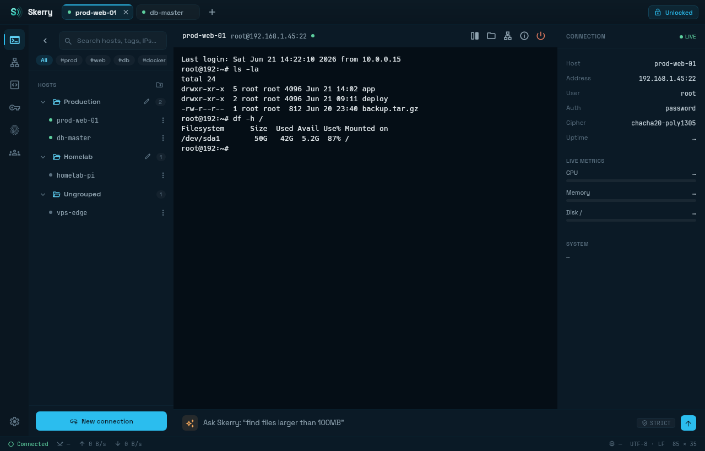
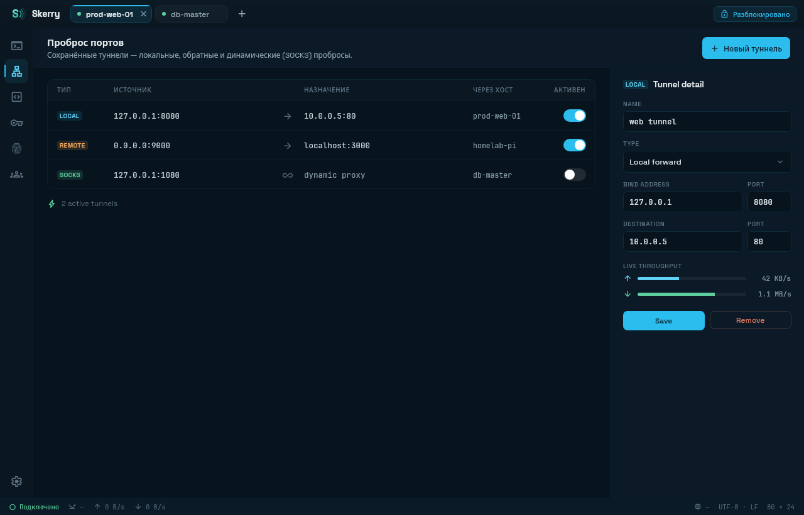
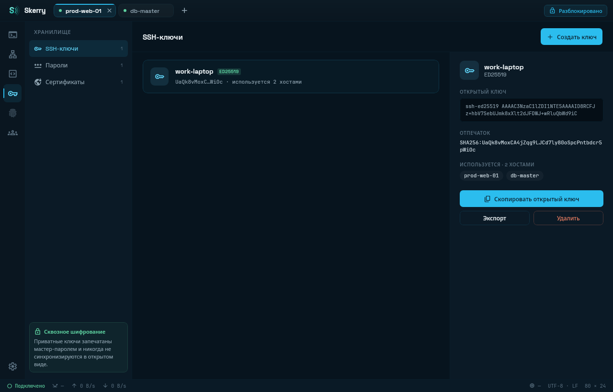
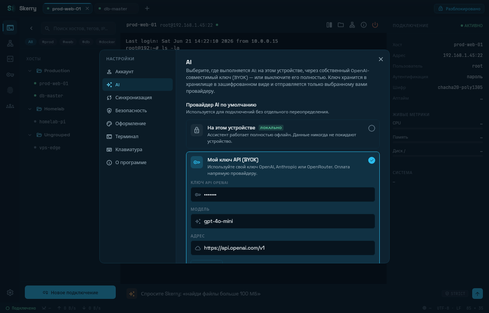
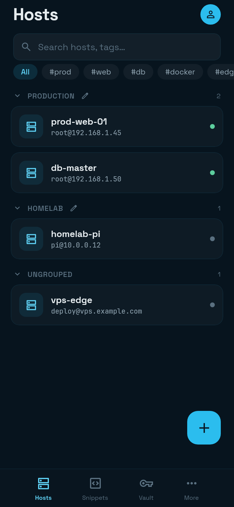
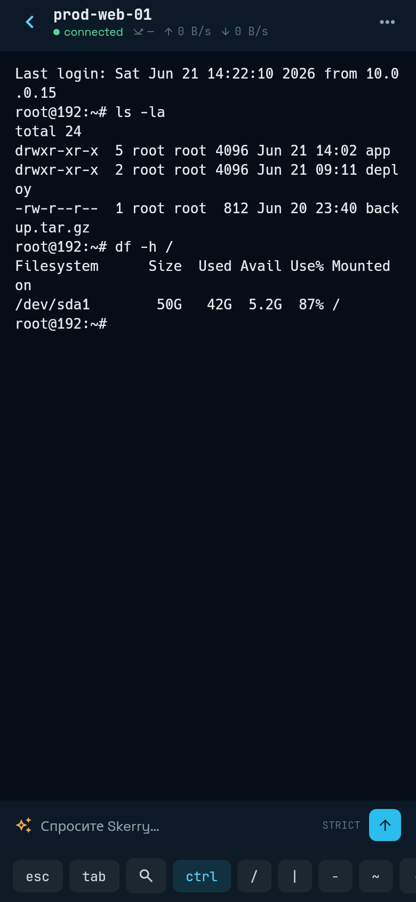

# Skerry

**中文** · [English](README.en.md) · [Русский](README.ru.md)

[](https://github.com/onepve/SkerrySSH/actions/workflows/ci.yml)
[](../../releases/latest)
[](LICENSE)
[](server/LICENSE)

Skerry 是一款开源、跨平台 SSH 客户端，基于 Kotlin Multiplatform 核心 + Compose Multiplatform
UI，**一份代码、一套 UI 覆盖桌面端（Linux、Windows、macOS）和 Android**，各平台功能一致。

- **本地优先** — 无需服务器或账户即可使用全部功能。
- **零知识** — 主密码从不离开设备。
- **AI 受策略约束** — 模型输出视为不可信；操作需确认；可选运行完全本地模型。
- **平台对等** — 功能在所有平台同时可用才算完成。

## 对比

| 特性 | Skerry | Termius | PuTTY | Tabby |
|---|---|---|---|---|
| **开源** | ✅ GPL-3.0 · AGPL-3.0 | ❌ | ✅ MIT | ✅ MIT |
| **平台** | Linux · Windows · macOS · Android | Windows · macOS · Linux · iOS · Android | Windows · Unix | Windows · macOS · Linux |
| **首发年份** | 2026 (v0.1.x) | 2011 | 1999 | 2017 |
| **价格** | 免费 | 免费版 / 付费 $10/月起 | 免费 | 免费 |
| **无需账户可用** | ✅ | ⚠️ 仅本地 <sup>1</sup> | ✅ | ✅ |
| **加密保险库** | ✅ 始终开启 <sup>2</sup> | ✅ | ❌ | ⚠️ 可选开启 |
| **同步** | ✅ 自托管，零知识 | ✅ 厂商云，端到端（付费） | ❌ | ✅ 可自托管，端到端可选 <sup>3</sup> |
| **团队共享** | ✅ 端到端 | ⚠️ 付费版 | ❌ | ❌ |
| **SFTP** | ✅ 双窗格界面 | ✅ | ⚠️ 仅 CLI (`psftp`) | ✅ 内建面板 |
| **端口转发** | ✅ 本地 · 远程 · 动态 | ✅ | ✅ | ✅ |
| **串口 / Telnet** | ✅ / ✅ | ✅ / ✅ | ✅ / ✅ | ✅ / ✅ |
| **Mosh** | ✅ | ✅ | ❌ | ❌ |
| **AI 助手** | ✅ 本地或 BYOK 云端 <sup>4</sup> | ⚠️ 云端，需账户 | ❌ | ❌ |

**图例：** ✅ 支持 · ⚠️ 部分支持 / 有限制 · ❌ 不支持

<sup>1</sup> 同步和 AI 需要账户 &nbsp;·&nbsp;
<sup>2</sup> Argon2id + XChaCha20-Poly1305 &nbsp;·&nbsp;
<sup>3</sup> 通过自托管 Tabby Web &nbsp;·&nbsp;
<sup>4</sup> 可选；模型输出不可信，操作需确认

*竞品数据采集于其官网和仓库，截至 2026-07-12。发现错误请提 PR。*

## 当前状态

活跃开发中，覆盖 **Linux**、**Windows**、**macOS** 和 **Android**。**iOS/iPadOS** 已列入计划。

## 安装

从 **[最新 Release](../../releases/latest)** 下载对应包：

| 平台 | 架构 | 文件 |
|---|---|---|
| Linux | x86_64 | `.deb`、`.rpm`、`.AppImage`、`.flatpak` |
| Linux | arm64 | `.deb`、`.rpm`、`.AppImage` |
| Windows | x64 | `.msi` `.zip`（便携版） |
| macOS | Apple Silicon | `Skerry-*-arm64.dmg` |
| macOS | Intel | `Skerry-*-x64.dmg` |
| Android | arm64-v8a | `.apk`（已签名，侧载） |

- **macOS 包未签名也未公证**（暂无 Apple 开发者账号），首次启动 Gatekeeper 会拦截：
  右键应用 → 打开，或在系统设置 → 隐私与安全中放行。Finder → 简介中的版本号显示
  `1.x.y`——实际对应 `0.x` 版本（macOS 打包要求主版本号 ≥1）；关于页面显示真实版本。
- Windows `.msi` 也未签名，首次运行 SmartScreen 可能警告。
- 用发布的校验和验证下载：`sha256sum -c --ignore-missing SHA256SUMS.txt`。

也可自行构建——见[从源码构建](#从源码构建)。

## 截图



<details>
<summary>更多截图</summary>








| 主机列表 | 终端 |
|---|---|
|  |  |

</details>

## 功能

- **连接** — SSH 跳板（ProxyJump）和 SSH 证书；SFTP（双窗格管理）；端口转发：本地、远程、动态/SOCKS；Telnet；串口（桌面和 Android USB-OTG）。
- **终端** — 自研网格仿真，会话标签支持分屏，SSH 自动重连，回滚搜索，实时主机指标。
- **保险库** — 始终加密（Argon2id + XChaCha20-Poly1305），管理密钥、密码、身份和证书；Android 支持生物识别解锁。
- **同步** — 可选、自托管、零知识，WebSocket 实时推送，设备通过二维码配对。详见[同步服务器](#同步服务器)。
- **团队** — 端到端加密共享主机和代码片段。
- **代码片段与 AI** — 命令库支持终端补全；AI 助手支持按主机策略——可自带 OpenAI 密钥或运行本地模型。详见 [AI 与隐私](#ai-与隐私)。
- **多语言** — 英文、中文、俄语 UI；AI 助手回复语言跟随 UI 语言。

完整功能清单见 **[docs/FEATURES.md](docs/FEATURES.md)**。

## AI 与隐私

保险库承诺（"主密码从不离开设备"）和云端 AI 助手只有在明确规则下才能共存：

- **无自动发送。** 请求仅包含你在 AI 栏或聊天中输入的内容，加上固定系统提示。终端输出、主机列表、保险库内容永不附带。
- **云端模式为 BYOK**：你自己的 OpenAI API 密钥；请求从应用直接发送到你配置的端点。
- **按主机策略**决定请求可发送到哪里：
  - **严格**（新主机默认）— 仅本地模型；任何数据不离开设备。
  - **平衡** — 允许云端；明显密钥（私钥、令牌、`password=…`）在发送前从提示中脱敏。脱敏为尽力模式匹配，不作绝对保证。
  - **宽松** — 允许云端、不脱敏，适用于非敏感系统。
  - **关闭** — 该主机隐藏 AI 功能。
- 全局快捷聊天始终脱敏密钥，即使使用本地模型。
- **本地模式**：应用自动下载 GGUF 模型（Qwen3、Phi-4 Mini）通过 llama.cpp 在设备本地运行——任何数据不离开设备。
- **模型输出不可信**：建议的命令不会自动执行——需要明确确认，高风险命令需二次确认。

## 技术栈

- **语言/UI**：Kotlin 2.x，Compose Multiplatform 1.11.1
- **构建**：Gradle 9.3.1，Android Gradle Plugin 9.0.1
- **JVM 目标**：JDK 21（所有模块 `jvmToolchain(21)`，`JVM_21`）
- **Android**：minSdk 26 (Android 8.0)，compileSdk/targetSdk 36
- **核心**：sshj 0.40.0，BouncyCastle 1.80.2，libsodium (ionspin KMP)，okio，atomicfu
- **串口**：jSerialComm 2.11.0（桌面），usb-serial-for-android 3.9.0（Android）
- **同步**：Ktor 3.4.3（客户端+服务端），Exposed 0.58.0，SQLite/PostgreSQL，HikariCP，Nimbus SRP-6a

## 仓库布局

```
shared/       # KMP 核心: ssh/, sftp/, vault/, sync/, team/, terminal/, ai/ (+ai/local),
              # telnet/, serial/, tunnel/, snippet/, host/, files/
composeApp/   # UI (Compose Multiplatform): commonMain + androidMain + desktopMain
androidApp/   # Android App (MainActivity, manifest); applicationId app.skerry
server/       # 自托管同步服务器 (Ktor, AGPL-3.0)
sync-wire/    # 客户端与服务端共享的传输数据结构
docs/         # HTML 原型和设计文档
```

## 从源码构建

以下内容面向贡献者——普通用户请从[安装](#安装)下载打包版本。
详见 **[CONTRIBUTING.zh.md](CONTRIBUTING.zh.md)**。

需要 **JDK 21**（`foojay-resolver` 自动获取）。Android 需要 Android SDK（`ANDROID_HOME`）。

桌面端（生成当前机器的 OS/CPU 架构包——在 macOS/ARM 上构建才能拿到 `.dmg`/arm64 包）：

```bash
./gradlew :composeApp:run                                # 直接运行
./gradlew :composeApp:packageDistributionForCurrentOS    # .deb / .rpm / .msi / .dmg
./gradlew :composeApp:packageAppImage                    # 便携 Linux .AppImage
./gradlew :composeApp:packageFlatpak                     # 单文件 Linux .flatpak (需 flatpak + flatpak-builder)
```

Android：

```bash
ANDROID_HOME=$HOME/Android/Sdk ./gradlew :androidApp:installDebug
```

测试 (JUnit 5)：

```bash
./gradlew test
```

## 同步服务器

Skerry 以本地优先——应用无需服务器即可完整使用。若要在多设备间同步保险库，你需运行**自己的**同步服务器；没有厂商云。

设计上服务器为零知识：仅存储加密数据（加密后的 `dataKey` 和保险库记录）及同步元数据。认证采用 SRP-6a——密码本身从不传输——服务器无法解密你存储的任何内容。

快速启动（预构建多架构镜像，SQLite 命名卷，零配置）：

```bash
docker run -d --name skerry-sync -p 8080:8080 \
  -e SKERRY_JWT_SECRET="$(openssl rand -base64 48)" \
  -e SKERRY_ADMIN_TOKEN="$(openssl rand -hex 16)" \
  -v skerry-data:/data \
  secherkasov/skerry-sync:latest
```

服务监听 `http://localhost:8080`，内建完全离线的管理控制台 `/console`。从仓库根目录构建：`docker compose up -d --build`。PostgreSQL 模式取消 `db` 服务和对应变量注释即可。

完整部署指南——配置参考、API 端点、TLS 终端（Caddy/nginx）、备份及隐私模型，详见 **[server/README.zh.md](server/README.zh.md)**。

## 安全

安全策略——如何私下报告漏洞、受支持版本、威胁模型及审计状态说明，详见 **[SECURITY.zh.md](SECURITY.zh.md)**。

## 贡献

欢迎贡献——环境搭建、构建测试命令、模块结构、提交规范及 PR 流程见 **[CONTRIBUTING.zh.md](CONTRIBUTING.zh.md)**。

## 许可证

- 客户端（`shared/`、`composeApp/`、`androidApp/`）— [GPL-3.0](LICENSE)
- 同步服务器（`server/`）— [AGPL-3.0](server/LICENSE)。服务器采用 AGPL 确保托管为服务的 fork 将修改回馈社区。
