<div align="center">

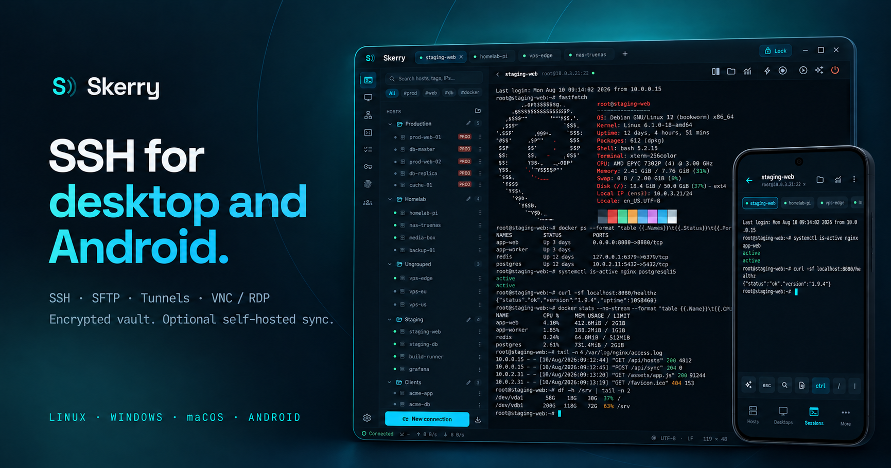

**English** · [Русский](README.ru.md) · [简体中文](README.zh.md)

Skerry is an open-source SSH client for Linux, Windows, macOS and Android.
Includes SFTP, port forwarding, VNC/RDP and an encrypted credential vault.

Local use requires no account. Device synchronization is optional and uses a self-hosted server.

**[Download Skerry](https://github.com/SeCherkasov/SkerrySSH/releases/latest)** · [User guide](https://github.com/SeCherkasov/SkerrySSH/wiki) · [Report a bug](https://github.com/SeCherkasov/SkerrySSH/issues/new/choose)

[](https://github.com/SeCherkasov/SkerrySSH/releases/latest)
[](https://github.com/SeCherkasov/SkerrySSH/actions/workflows/ci.yml)
[](LICENSE)
[](server/LICENSE)

[Features](#features) · [Screenshots](#screenshots) · [Install](#install) · [Privacy](#privacy) · [Development](#build)

</div>

<a id="features"></a>

## Features

| Component | Capabilities |
| :--- | :--- |
| **Connections** | SSH, Mosh, jump hosts and SSH config import. |
| **Terminal** | Up to four panes per tab, synchronized input, output search and session recording. |
| **SFTP** | Dual-pane file manager, file editor and transfer queue. |
| **Tunnels** | Local, remote and SOCKS forwarding with saved configurations. |
| **Remote desktops** | VNC and RDP with clipboard exchange. |
| **Operations** | Host metrics, alerts, Docker/Kubernetes shells, snippets and runbooks. |
| **Production guard** | Confirmation of risky commands on hosts tagged `prod`. |
| **Collaboration** | Encrypted sharing of hosts, snippets and runbooks; live terminal sharing. |

<details>
<summary>Additional capabilities</summary>

- **Connections:** SSH certificates, keyboard-interactive authentication, Telnet and serial connections; import from `~/.ssh/config`.
- **Terminal:** command history, input broadcast and asciinema v2 recording with playback.
- **Files and tunnels:** file viewing, name filtering and one-click forwarding of discovered ports.
- **Sessions:** VNC/RDP settings can be changed while connected; shared terminals support viewing or keyboard control.
- **Runbooks:** sequential command execution and file transfer steps.

</details>

<a id="screenshots"></a>

## Screenshots

<table>
<tr>
<td width="50%" align="center"><strong>Split terminals</strong><br><br><a href="docs/screenshots/panes.webp">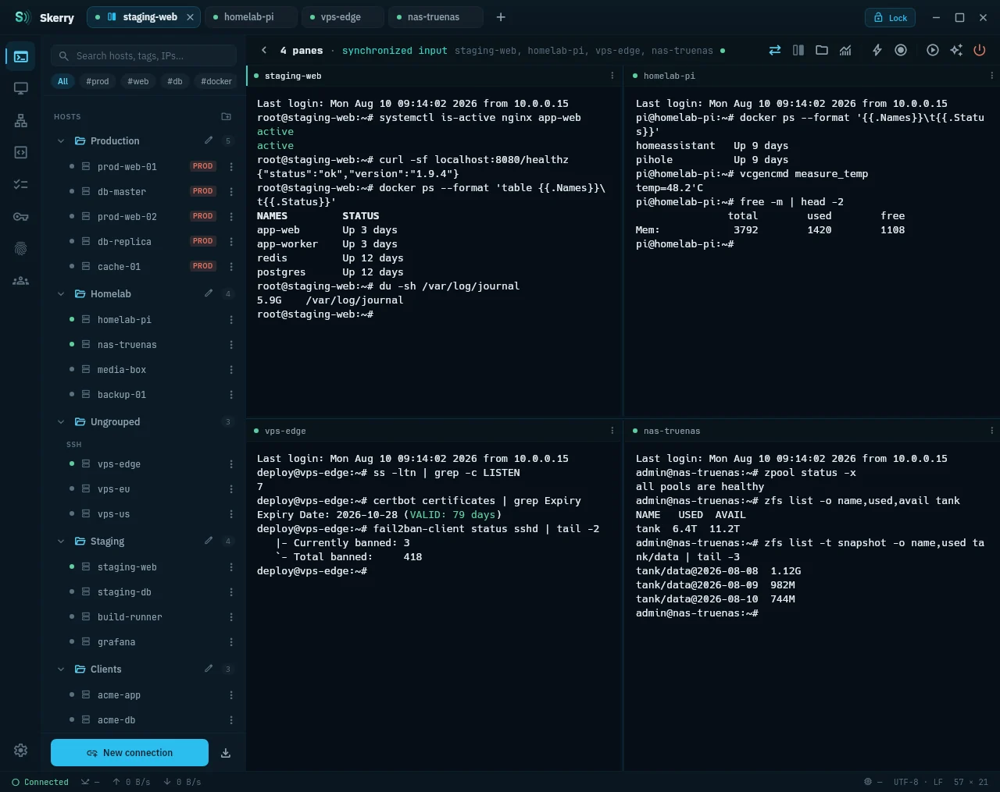</a></td>
<td width="50%" align="center"><strong>SFTP commander</strong><br><br><a href="docs/screenshots/sftp.webp">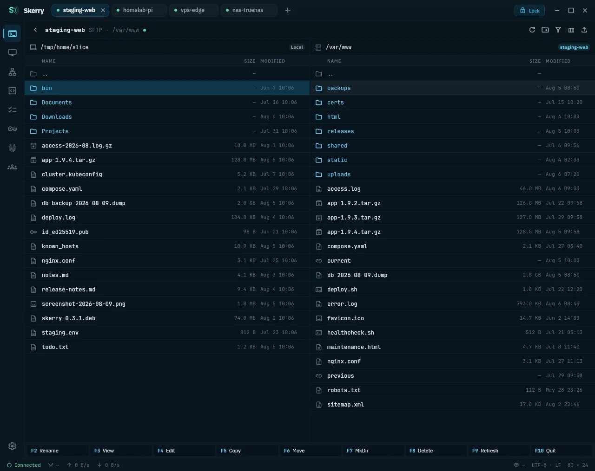</a></td>
</tr>
<tr>
<td width="50%" align="center"><strong>Encrypted vault</strong><br><br><a href="docs/screenshots/vault.webp">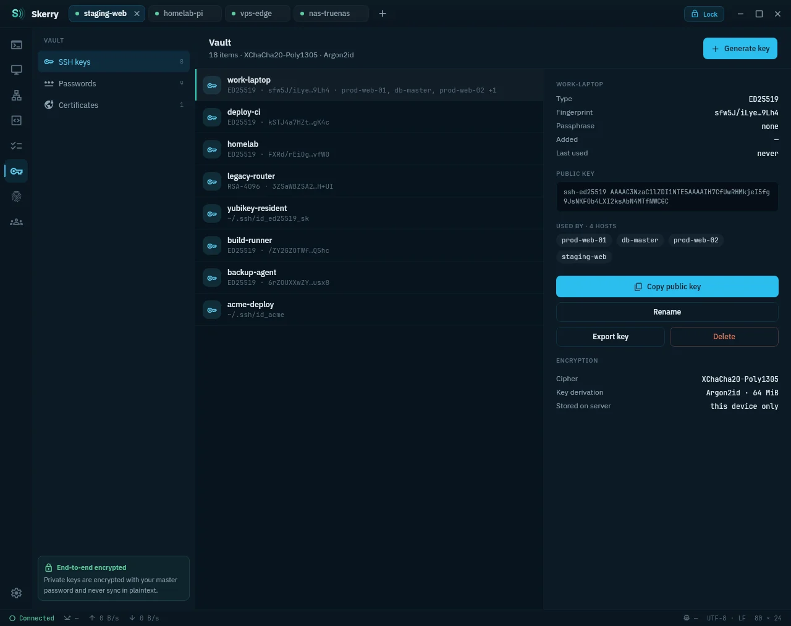</a></td>
<td width="50%" align="center"><strong>Runbooks</strong><br><br><a href="docs/screenshots/runbooks.webp">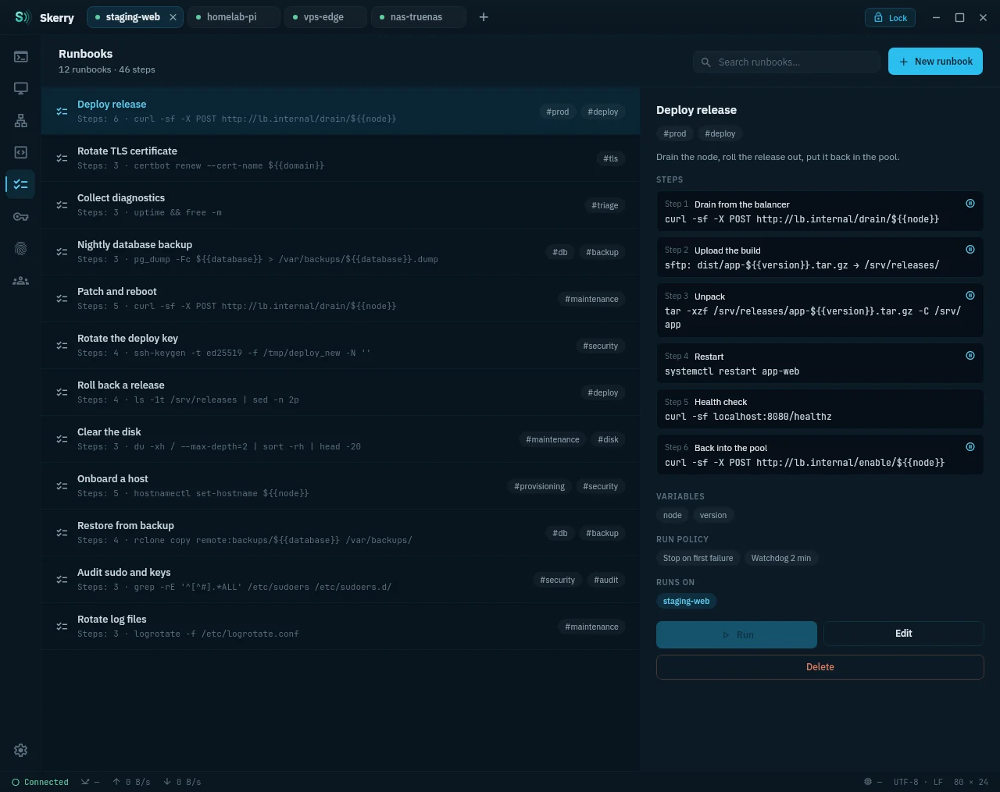</a></td>
</tr>
</table>

*Click any image for the full-size view.*

### Android

The Android interface includes an extra terminal key row and biometric vault unlock.

<p align="center">
  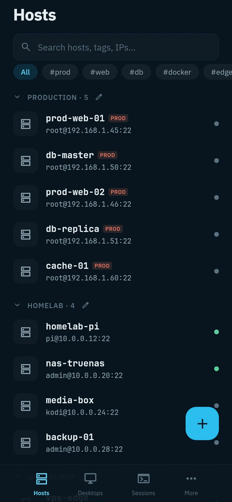
  &nbsp;&nbsp;
  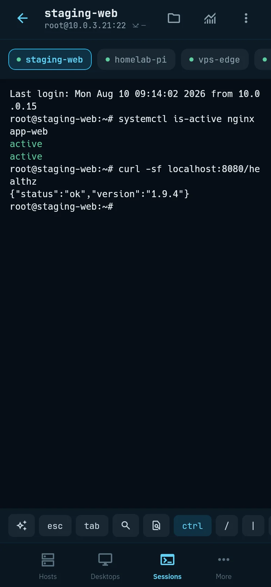
</p>

Dark, light and system themes. UI in **English, Russian, Simplified Chinese, Turkish and German**.

<details>
<summary>More views — terminal, tunnels, snippets, AI and teams</summary>

#### Terminal

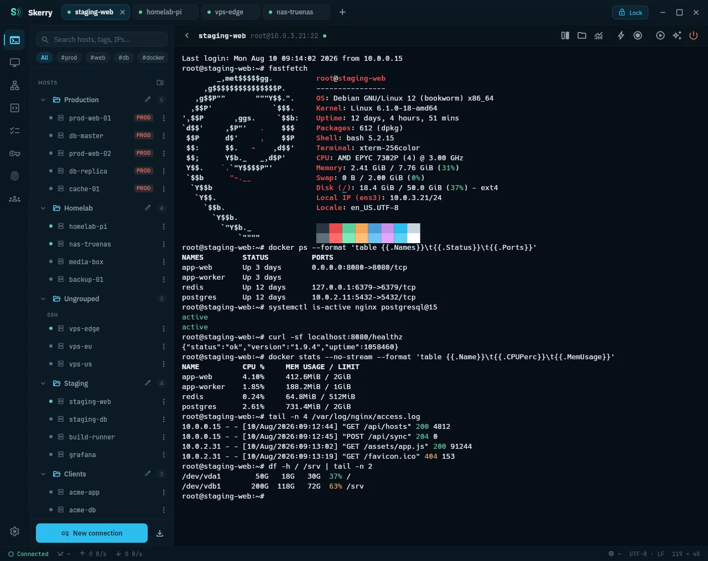

#### Port forwarding

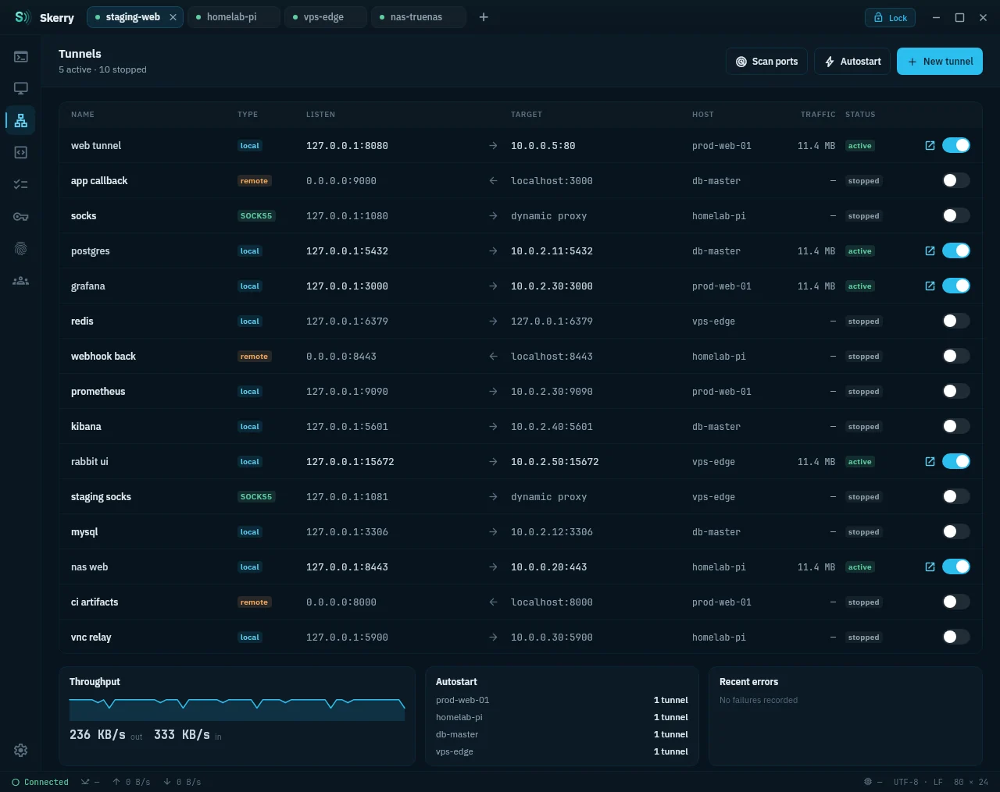

#### Snippets

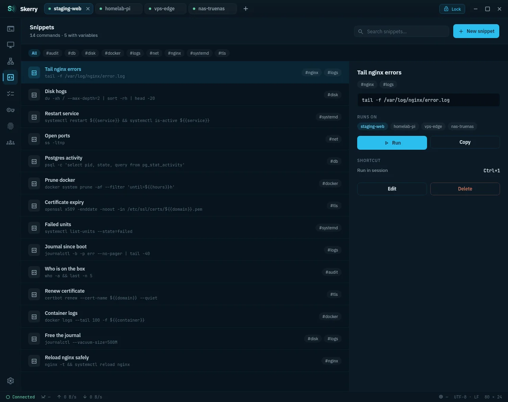

#### AI settings

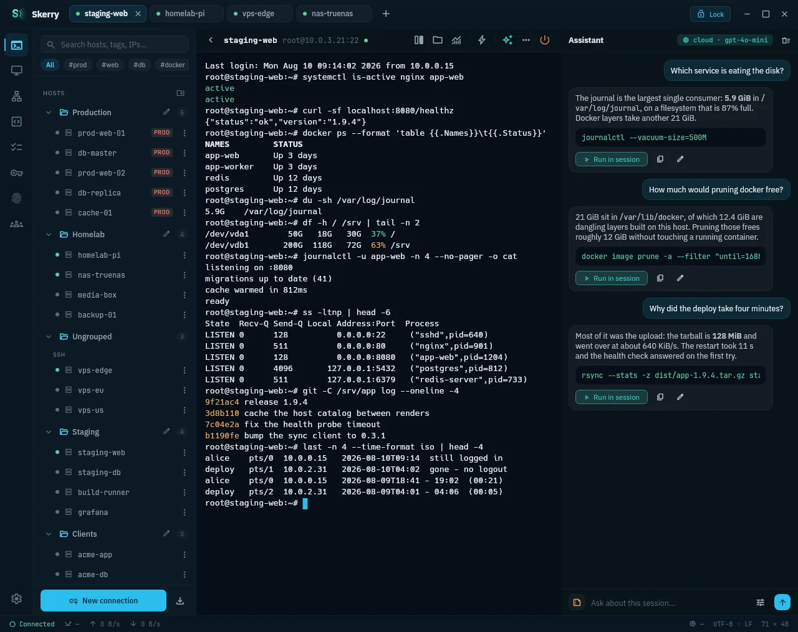

#### Teams

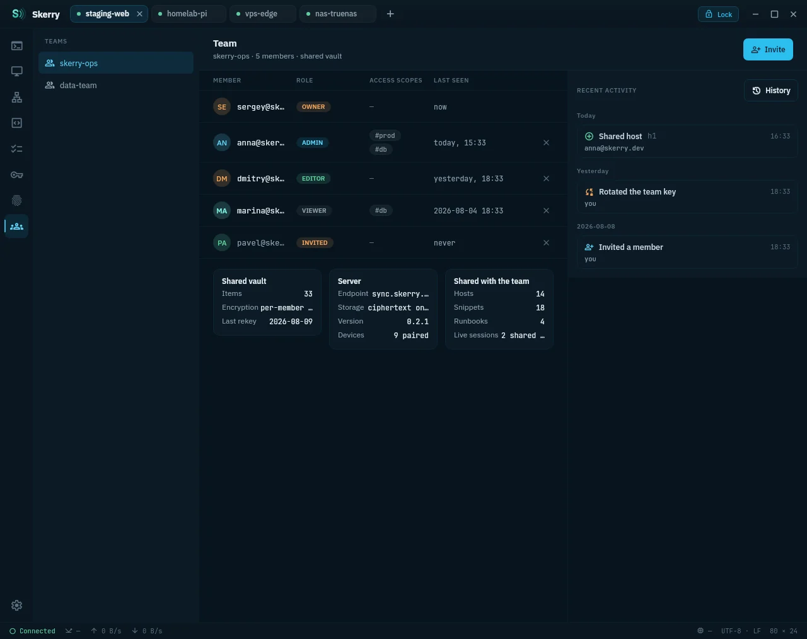

</details>

*The banner is a presentation illustration based on the app's interface. Screenshots use demonstration hosts and data.*

<a id="install"></a>

## Install Skerry

Download the package for your platform from the **[latest release](https://github.com/SeCherkasov/SkerrySSH/releases/latest)**.
Skerry is actively developed and is currently **pre-1.0**.

| Platform | Architecture | Packages |
| :--- | :--- | :--- |
| Linux | x86_64 · arm64 | `.deb` · `.rpm` · `.AppImage` |
| Windows | x64 | `.msi` · `.zip` |
| macOS | Apple Silicon · Intel | `.dmg` |
| Android 8.0+ | arm64-v8a | `.apk` |

The Windows ZIP archive is portable.

1. Install Skerry and create a local vault with a master password.
2. Add a host and its credentials, or import your SSH config on desktop.
3. Open a session. Files, monitoring and forwarding are available alongside it.

Keep your master password safe: **it cannot be recovered**.

<details>
<summary>Installation notes — signing, checksums and macOS version numbers</summary>

Desktop installers are currently unsigned; macOS builds are not notarized. Windows SmartScreen
or macOS Gatekeeper may ask you to allow the app on first launch. On macOS, use System Settings
→ Privacy & Security to allow the downloaded application.

Releases include `SHA256SUMS.txt`. On Linux, verify the downloaded packages from their directory:

```bash
sha256sum -c --ignore-missing SHA256SUMS.txt
```

macOS Get Info shows a `1.x.y` bundle version because of packaging requirements. The actual
Skerry version is shown in the application's About screen.

</details>

Linux, Windows, macOS and Android are actively developed. iOS/iPadOS is deferred; no iOS target ships yet.

<a id="privacy"></a>

## Vault and synchronization

- **Local vault:** Argon2id and XChaCha20-Poly1305 protect keys, passwords, identities and certificates. The master password and plaintext encryption keys stay on the device.
- **Optional synchronization:** a self-hosted server stores encrypted records, wrapped keys and sync metadata. It is designed to be unable to decrypt vault contents.
- **Device and team access:** QR-code pairing and end-to-end encrypted sharing of hosts, snippets and runbooks.

Deployment, TLS and backups are covered in the [sync server guide](server/README.md).
Use HTTPS over untrusted networks; the server needs a TLS reverse proxy.

**The cryptography has not been independently audited.** See the
[security policy and threat model](SECURITY.md) for limitations and private vulnerability reporting.

## AI and privacy

AI supports local GGUF models through llama.cpp and OpenAI-compatible endpoints with your own
API key. **The default host policy allows local models only.** Cloud requests go directly to the
configured provider when the host policy permits them.

**The session assistant includes the last two command outputs by default.** Set the context
selector to zero to omit them. Suggested commands require confirmation before execution;
risky commands require an additional confirmation.

<details>
<summary>Host policies and data sent to the model</summary>

| Policy | Behavior |
| :--- | :--- |
| **Strict** · default | Local model only, with secret redaction. |
| **Balanced** | Cloud allowed; recognizable secrets are redacted before sending. |
| **Permissive** | Cloud allowed without redaction. |
| **Off** | AI disabled for this host. |

- **Session assistant:** question, conversation history and the selected number of recent command outputs.
- **Explain:** selected output or the last command block.
- **Host lists and vault records:** not automatically attached.
- **Redaction:** best-effort pattern matching, not a guarantee. Quick-chat always redacts recognizable secrets, including in local mode.

</details>

<a id="build"></a>

## Development

Built with **Kotlin Multiplatform, Compose Multiplatform and Ktor**. Client builds need **JDK 21 and the Android SDK**, even for desktop. Set `ANDROID_HOME` or `sdk.dir` in `local.properties`.

```bash
./gradlew :composeApp:run               # Desktop
./gradlew :androidApp:installDebug      # Android
./gradlew :server:run -PserverOnly      # Server
```

Server-only builds do not need the Android SDK. Configure `SKERRY_JWT_SECRET` as described in [server setup](server/README.md#quick-start).

[Contributing](CONTRIBUTING.md) · [Development & verification](docs/development-process.md) · [Dependency versions](gradle/libs.versions.toml) · [Issues & feature requests](https://github.com/SeCherkasov/SkerrySSH/issues/new/choose)

## License

Clients: **[GPL-3.0](LICENSE)**. Sync server: **[AGPL-3.0](server/LICENSE)**.
Bundled font licenses and attribution are in [licenses/](licenses/README.md).
