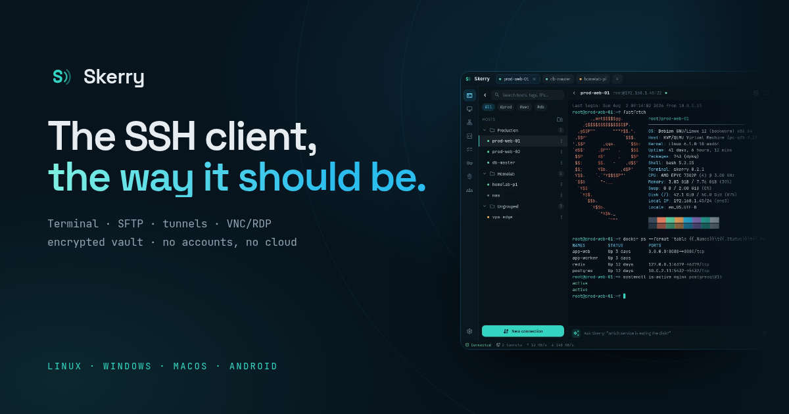
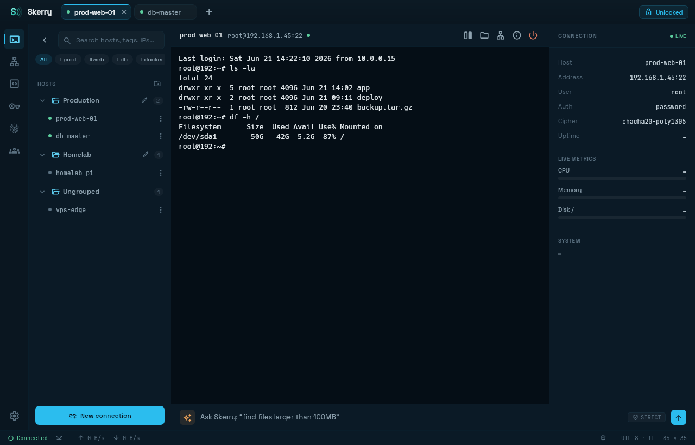
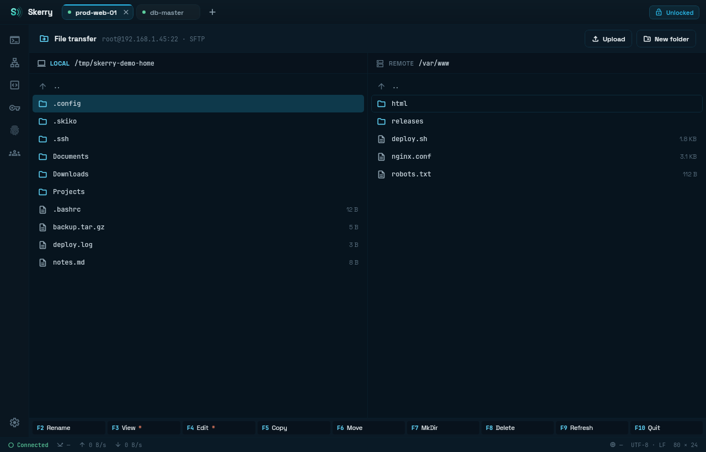
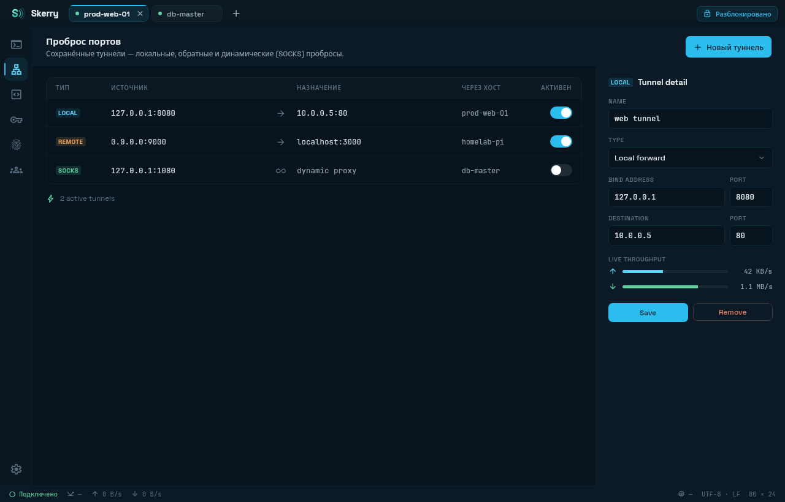
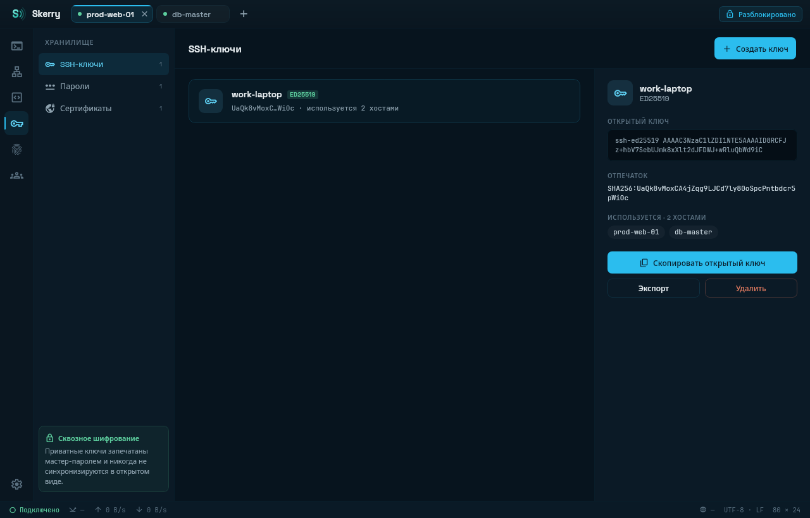
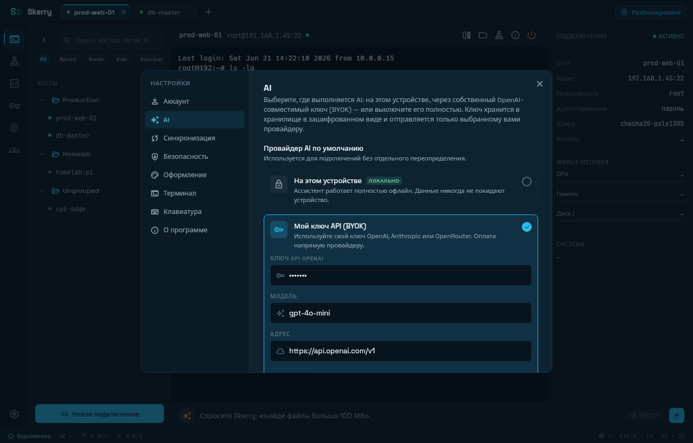
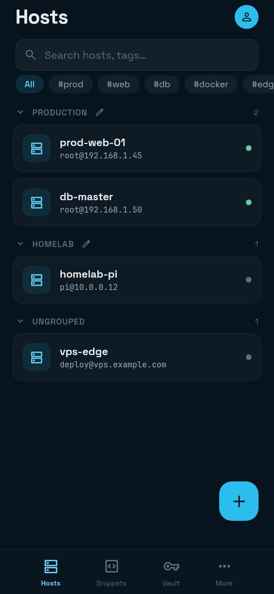
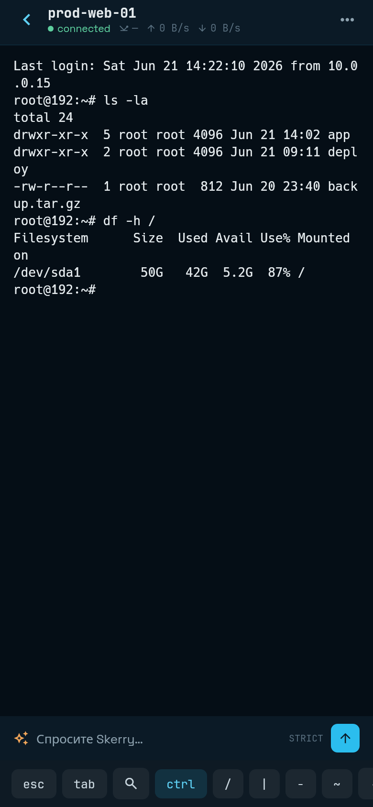

<div align="center">



[English](README.md) · **Русский**

[](https://github.com/SeCherkasov/SkerrySSH/actions/workflows/ci.yml)
[](../../releases/latest)
[](LICENSE)
[](server/LICENSE)

</div>

---

Опенсорсный SSH-клиент с единым ядром (Kotlin Multiplatform) для всех платформ:
**Linux · Windows · macOS · Android**.

- **Local-first** — полная функциональность без аккаунта и внешних сервисов; синхронизация
  опциональна, сервер разворачивается самостоятельно.
- **Zero-knowledge** — хранилище под Argon2id + XChaCha20-Poly1305; мастер-пароль и ключи
  шифрования не покидают устройство.
- **AI under policy** — вывод модели трактуется как недоверенный ввод: исполнение команды
  требует явного подтверждения; локальный инференс (llama.cpp) исключает исходящий трафик.

---

## Сравнение с аналогами

| | Skerry | Termius | PuTTY | Tabby |
|---|---|---|---|---|
| **Лицензия** | GPL-3.0 / AGPL-3.0 | проприетарная | MIT | MIT |
| **Платформы** | Linux · Windows · macOS · Android | Linux · Windows · macOS · Android · iOS | Windows · Unix | Linux · Windows · macOS |
| **Цена** | бесплатно | от $10/мес | бесплатно | бесплатно |
| **Без аккаунта** | ✅ | ⚠️ только локально | ✅ | ✅ |
| **Шифрованное хранилище** | ✅ | ✅ | ❌ | ⚠️ опционально |
| **Синхронизация** | ✅ self-hosted | ✅ облако вендора | ❌ | ✅ self-hosted |
| **Шаринг в командах** | ✅ | ⚠️ платно | ❌ | ❌ |
| **SFTP** | ✅ две панели | ✅ | ⚠️ только CLI | ✅ |
| **Mosh** | ✅ | ✅ | ❌ | ❌ |
| **VNC / RDP** | ✅ | ❌ | ❌ | ❌ |
| **Совместные сессии** | ✅ | ⚠️ платно | ❌ | ❌ |
| **AI-ассистент** | ✅ локальный или BYOK | ⚠️ только облако | ❌ | ❌ |

*Данные о конкурентах — по официальным сайтам проектов, 2026-07-23. В случае ошибки пришлите PR
с исправлением или заведите [issue](../../issues/new).*

---

## Статус

В активной разработке под **Linux**, **Windows**, **macOS** и **Android**.

**iOS/iPadOS** отложены из-за отсутствия оборудования для сборки и отладки — таргетов iOS
в проекте нет.

---

## Установка

Пакеты — в **[последнем релизе](../../releases/latest)**:

| Платформа | Архитектура | Файлы |
|---|---|---|
| Linux | x86_64 | `.deb`, `.rpm`, `.AppImage`, `.flatpak` |
| Linux | arm64 | `.deb`, `.rpm`, `.AppImage` |
| Windows | x64 | `.msi`, `.zip` |
| macOS | Apple Silicon | `.dmg` |
| macOS | Intel | `.dmg` |
| Android | arm64-v8a | `.apk` |

- **Подписи.** Сборки не подписаны: аккаунта Apple Developer нет. Gatekeeper блокирует первый
  запуск macOS-сборки — правый клик по приложению → Open, либо System Settings → Privacy &
  Security. Windows `.msi` тоже без подписи, SmartScreen предупреждает при первом запуске.
- **Версия в бандле macOS.** Get Info показывает `1.x.y` вместо `0.x`: упаковка требует мажорную
  версию ≥ 1. Настоящая версия — на экране About.
- **Контрольные суммы.** `sha256sum -c --ignore-missing SHA256SUMS.txt`

Сборка из исходников — в разделе [ниже](#сборка-из-исходников).

---

## Скриншоты



<details>
<summary>Больше скриншотов</summary>









| Список хостов | Терминал |
|---|---|
|  |  |

</details>

---

## Возможности

- **Протоколы** — SSH, Mosh, Telnet, serial (desktop и Android USB-OTG), локальный shell во
  вкладке без подключения.
- **SSH** — jump-хосты (ProxyJump), сертификаты из хранилища или с диска, хост-ключи от CA,
  keyboard-interactive 2FA, авто-реконнект, импорт хостов из `~/.ssh/config`.
- **SFTP** — двухпанельный commander: просмотр и правка файлов, настраиваемые колонки, фильтр по
  имени, очередь передач.
- **Port forwarding** — local, remote, dynamic/SOCKS, автоподъём форвардов после разблокировки
  хранилища, проброс доступных портов в один клик.
- **Контейнеры** — exec в контейнер Docker или под Kubernetes прямо с хоста.
- **Удалённые рабочие столы** — VNC и RDP на собственном клиентском стеке: скриншот,
  Ctrl+Alt+Del, обмен буфером, смена настроек посреди сессии. H.264 в RDP при наличии декодера:
  Android — всегда, десктоп — `ffmpeg` в PATH.
- **Терминал** — своя grid-эмуляция, до четырёх панелей на вкладку с синхронным вводом, поиск по
  scrollback, подсветка синтаксиса, палитра команд по истории, трансляция ввода в несколько
  сессий, открытие файловых путей из вывода в SFTP, запись сессий (asciinema v2) с
  проигрывателем.
- **Мониторинг хоста** — отдельный экран: CPU, память и сеть с историей, диск и swap уровнями,
  топ процессов, юниты systemd, точки монтирования, контейнеры, пороговые алерты на устройстве.
- **Совместные сессии** — трансляция терминала коллеге по E2E-каналу: только просмотр или с
  передачей клавиатуры.
- **Production guard** — оценка риска каждой команды на хостах с тегом `prod`, подтверждение для
  опасных.
- **Раннбуки** — пошаговый прогон процедуры в живой сессии: шаг — команда или передача файла по
  SFTP, пауза на подтверждение, останов на ненулевом коде возврата. Журнал прогонов: состояние,
  время и вывод каждого шага.
- **Сниппеты** — библиотека команд с type-ahead, переменные `${{…}}` (дата/время, uuid, random,
  буфер обмена, секреты хранилища, запрашиваемые параметры) с раскрытием при запуске за диалогом
  подтверждения.
- **AI** — политика на каждый хост, панель ассистента рядом с сессией на десктопе, форма ввода
  по кнопке на мобильном, свой ключ OpenAI или локальная модель.
  См. [AI и приватность](#ai-и-приватность).
- **Хранилище** — Argon2id + XChaCha20-Poly1305 для ключей, паролей, identities и сертификатов,
  биометрическая разблокировка на Android, карточка секрета с алгоритмом, отпечатком, сроком
  действия, зависимостями и последним использованием, корзина на 30 дней с восстановлением на
  любом синхронизированном устройстве.
- **Синхронизация** — опциональная, self-hosted, zero-knowledge: live push по WebSocket, паринг
  устройств по QR, веб-кабинет за отдельным паролем — метаданные и отзыв устройства, ничего
  больше. См. [Sync-сервер](#sync-сервер).
- **Teams** — E2E-шаринг хостов, сниппетов и раннбуков, области доступа для каждого участника,
  лента активности: кто менял хост и кто открывал сессию.
- **Интерфейс** — тёмные и светлые темы, терминал по теме приложения, «Системная» с
  отслеживанием ОС, языки: английский, русский, упрощённый китайский.

---

## AI и приватность

Границы, в которых работает ассистент:

- **Содержимое запроса** — текст запроса и фиксированный системный промпт. Вывод терминала,
  списки хостов и записи хранилища не передаются.
- **Облачный режим** — только со своим ключом OpenAI: трафик идёт из приложения на указанный
  endpoint, без промежуточных серверов.
- **Политика хоста** — определяет адресата запроса:
  - **Strict** (по умолчанию для новых хостов) — только локальная модель.
  - **Balanced** — облако, из промпта вырезаются очевидные секреты: приватные ключи, токены,
    `password=…`. Механизм — сопоставление с паттернами, гарантий не даёт.
  - **Permissive** — облако без редакции, для нечувствительных систем.
  - **Off** — ассистент на хосте скрыт.
- **Quick-chat** — редакция секретов включена всегда, в том числе для локальной модели.
- **Локальные модели** — GGUF (Qwen3, Phi-4 Mini) через llama.cpp на устройстве, исходящего
  трафика нет.
- **Исполнение команд** — вывод модели недоверенный: запуск по явному подтверждению, для
  рискованных команд — второе подтверждение.

---

## Технологии

- **Язык и UI** — Kotlin 2.4, Compose Multiplatform 1.9
- **Сборка** — Gradle 9.6, Android Gradle Plugin 9.1, JDK 21 (`jvmToolchain(21)` во всех модулях)
- **Android** — minSdk 26 (Android 8.0), compileSdk 37, targetSdk 36
- **SSH и криптография** — sshj, BouncyCastle, libsodium (ionspin KMP): Argon2id +
  XChaCha20-Poly1305
- **Терминал** — своя grid-эмуляция, pty4j для локального shell на десктопе
- **Удалённые рабочие столы** — собственные стеки VNC (RFB) и RDP, без сторонних клиентов
- **Serial** — jSerialComm (desktop), usb-serial-for-android (Android)
- **AI** — llamatik (биндинг llama.cpp) для локальных моделей, Ktor-клиент для облака
- **Sync** — Ktor (клиент и сервер), Exposed, SQLite/PostgreSQL, HikariCP, Nimbus SRP-6a
- **Качество** — JUnit 5, покрытие Kover, статанализ detekt

Точные версии — в [`gradle/libs.versions.toml`](gradle/libs.versions.toml).

---

## Структура репозитория

```
shared/       # ядро KMP: ssh/, sftp/, vault/, sync/, team/, share/, terminal/, ai/ (+ai/local),
              # telnet/, serial/, mosh/, rdp/, vnc/, graphics/, audio/, tunnel/, container/,
              # snippet/, runbook/, host/, tag/, files/, guard/, update/
composeApp/   # UI (Compose Multiplatform): commonMain + androidMain + desktopMain
androidApp/   # Android-приложение (MainActivity, манифест), applicationId app.skerry
server/       # self-hosted sync-сервер (Ktor, AGPL-3.0)
sync-wire/    # wire-контракт, общий для клиента и сервера
docs/         # документация и дизайн-материалы
```

---

## Сборка из исходников

Процесс разработки, соглашения по коммитам и заметки по упаковке — в
**[CONTRIBUTING.md](CONTRIBUTING.md)**.

Требуется **JDK 21** (`foojay-resolver` подтянет при необходимости), для Android — Android SDK
в `ANDROID_HOME`.

Пакет собирается под ОС и архитектуру машины сборки: `.dmg` под arm64 получается только на
macOS/ARM.

```bash
./gradlew :composeApp:run                                # запуск
./gradlew :composeApp:packageDistributionForCurrentOS    # .deb / .rpm / .msi / .dmg
./gradlew :composeApp:packageAppImage                    # портативный Linux .AppImage
./gradlew :composeApp:packagePortableZip                 # портативный .zip
./gradlew :composeApp:packageFlatpak                     # однофайловый .flatpak (нужны flatpak и flatpak-builder)
```

Android:

```bash
ANDROID_HOME=$HOME/Android/Sdk ./gradlew :androidApp:installDebug
```

Тесты (JUnit 5) и статанализ:

```bash
./gradlew test allTests    # один `test` пропускает мультиплатформенные модули
./gradlew detektAll        # накопленные замечания — в gradle/detekt-baseline-*.xml
```

---

## Sync-сервер

Сервер нужен только для синхронизации между устройствами, и это всегда ваш сервер:
вендорского облака нет.

Zero-knowledge по построению: на сервере лежит шифротекст (обёрнутый `dataKey`, зашифрованные
записи хранилища) и метаданные синхронизации. Аутентификация — SRP-6a, пароль не передаётся,
расшифровать данные сервер не может.

Быстрый старт — готовый мультиархитектурный образ с
[Docker Hub](https://hub.docker.com/r/secherkasov/skerry-sync), SQLite в именованном томе, без
конфигурации:

```bash
docker run -d --name skerry-sync -p 8080:8080 \
  -e SKERRY_JWT_SECRET="$(openssl rand -base64 48)" \
  -e SKERRY_ADMIN_TOKEN="$(openssl rand -hex 16)" \
  -v skerry-data:/data \
  secherkasov/skerry-sync:latest
```

Сервер слушает `http://localhost:8080` и несёт встроенный офлайновый веб-интерфейс: публичная
страница на `/`, кабинет аккаунта на `/account`, консоль оператора на `/console`. Сборка из
исходников — `docker compose up -d --build` из корня репозитория; PostgreSQL включается
сервисом `db` и postgres-переменными в [docker-compose.yml](docker-compose.yml). Сборка только
сервера обходится без Android SDK: `./gradlew :server:run -PserverOnly`.

Конфигурация, API-эндпоинты, TLS-терминация (Caddy/nginx), бэкапы и модель приватности — в
**[server/README.md](server/README.md)** ([RU](server/README.ru.md)).

---

## Безопасность

Приватное сообщение об уязвимости, поддерживаемые версии, модель угроз и статус аудита — в
**[SECURITY.md](SECURITY.md)**.

---

## Участие в разработке

Issue и pull request приветствуются. Настройка окружения, структура модулей, порядок разработки
и требования к PR — в **[CONTRIBUTING.md](CONTRIBUTING.md)**.

---

## Лицензии

- Клиенты (`shared/`, `composeApp/`, `androidApp/`) — [GPL-3.0](LICENSE)
- Sync-сервер (`server/`) — [AGPL-3.0](server/LICENSE): форк, поднятый как сервис, обязан
  вернуть свои изменения в проект.
