<div align="center">


[English](README.md) · [Русский](README.ru.md) · **简体中文**

[](https://github.com/SeCherkasov/SkerrySSH/actions/workflows/ci.yml)
[](../../releases/latest)
[](LICENSE)
[](server/LICENSE)

</div>

---

开源 SSH 客户端，单一内核（Kotlin Multiplatform），覆盖所有平台：
**Linux · Windows · macOS · Android**。

- **本地优先** — 无需账号和外部服务即可完整使用；同步是可选的，且由你自己托管。
- **零知识** — 保险库由 Argon2id + XChaCha20-Poly1305 封存；主密码和加密密钥从不离开设备。
- **AI 受策略约束** — 模型输出被当作不可信输入：执行命令需要明确确认；本地推理（llama.cpp）
  杜绝一切外发流量。

---

## 与同类产品对比

| | Skerry | Termius | PuTTY | Tabby |
|---|---|---|---|---|
| **许可证** | GPL-3.0 / AGPL-3.0 | 专有 | MIT | MIT |
| **平台** | Linux · Windows · macOS · Android | Linux · Windows · macOS · Android · iOS | Windows · Unix | Linux · Windows · macOS |
| **价格** | 免费 | 每月 $10 起 | 免费 | 免费 |
| **无需账号** | ✅ | ⚠️ 仅本地 | ✅ | ✅ |
| **加密保险库** | ✅ | ✅ | ❌ | ⚠️ 需手动开启 |
| **同步** | ✅ 自托管 | ✅ 厂商云 | ❌ | ✅ 自托管 |
| **团队共享** | ✅ | ⚠️ 付费 | ❌ | ❌ |
| **SFTP** | ✅ 双栏 | ✅ | ⚠️ 仅命令行 | ✅ |
| **Mosh** | ✅ | ✅ | ❌ | ❌ |
| **VNC / RDP** | ✅ | ❌ | ❌ | ❌ |
| **实时会话共享** | ✅ | ⚠️ 付费 | ❌ | ❌ |
| **AI 助手** | ✅ 本地或自带密钥 | ⚠️ 仅云端 | ❌ | ❌ |

*竞品数据取自各项目官网，2026-07-23。如有出入，请提交 PR 更正或开一个
[issue](../../issues/new)。*

---

## 状态

**Linux**、**Windows**、**macOS** 和 **Android** 处于活跃开发中。

**iOS/iPadOS** 已推迟，原因是缺少用于构建和调试的硬件 — 项目中没有 iOS 目标。

---

## 安装

安装包见 **[最新发布](../../releases/latest)**：

| 平台 | 架构 | 文件 |
|---|---|---|
| Linux | x86_64 | `.deb`、`.rpm`、`.AppImage` |
| Linux | arm64 | `.deb`、`.rpm`、`.AppImage` |
| Windows | x64 | `.msi`、`.zip` |
| macOS | Apple Silicon | `.dmg` |
| macOS | Intel | `.dmg` |
| Android | arm64-v8a | `.apk` |

- **签名。** 构建产物未签名：项目没有 Apple 开发者账号。Gatekeeper 会拦截 macOS 构建的首次
  启动 — 右键点击应用 → 打开，或在 系统设置 → 隐私与安全性 中放行。Windows 的 `.msi` 同样
  未签名，SmartScreen 会在首次运行时告警。
- **macOS 包版本。** “显示简介”里显示的是 `1.x.y` 而不是 `0.x`：打包要求主版本号 ≥ 1。
  真实版本在“关于”界面上。
- **校验和。** `sha256sum -c --ignore-missing SHA256SUMS.txt`

从源码构建见[下文](#从源码构建)。

---

## 截图

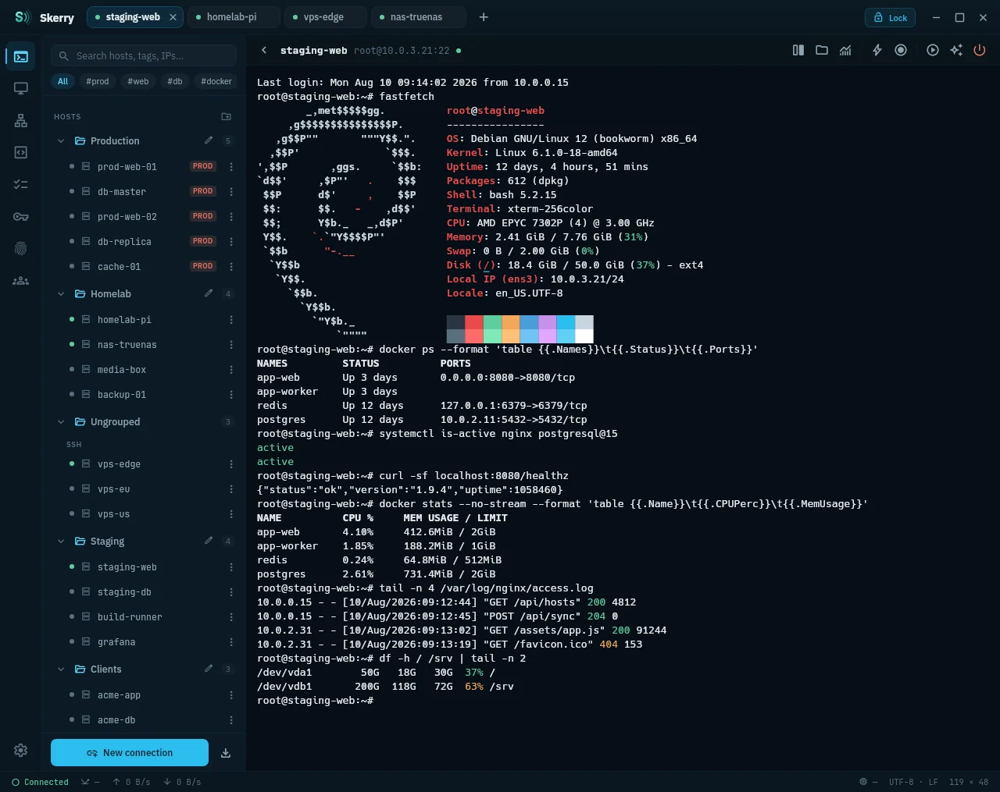

<details>
<summary>更多截图</summary>

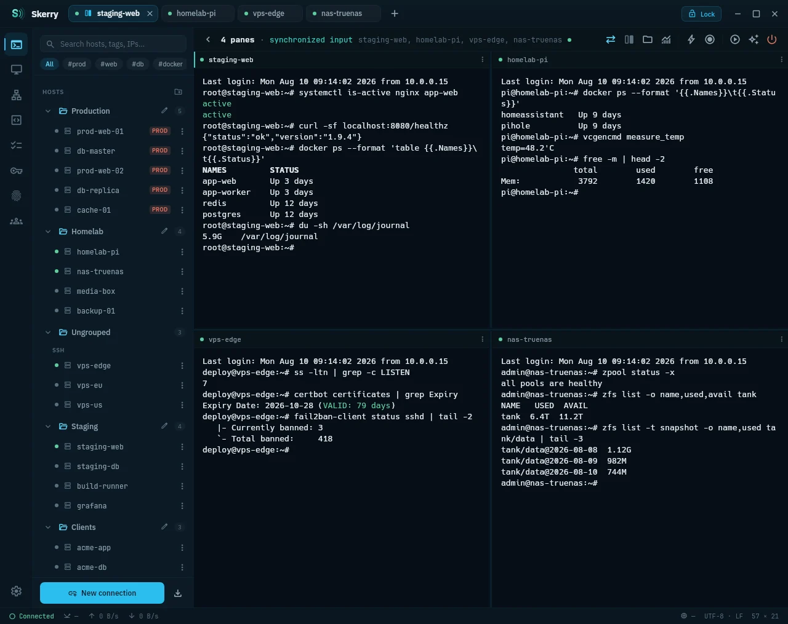

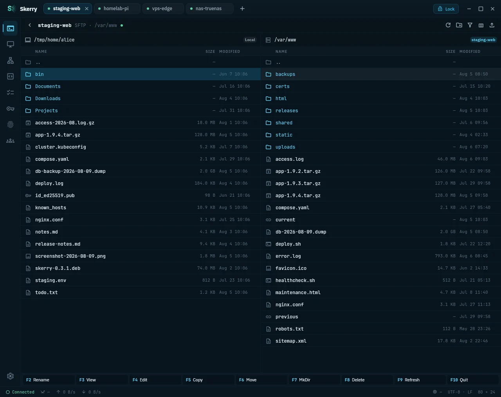

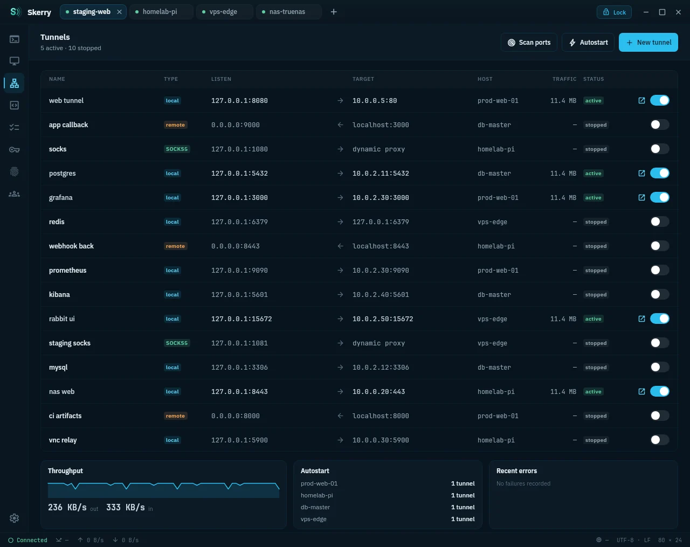

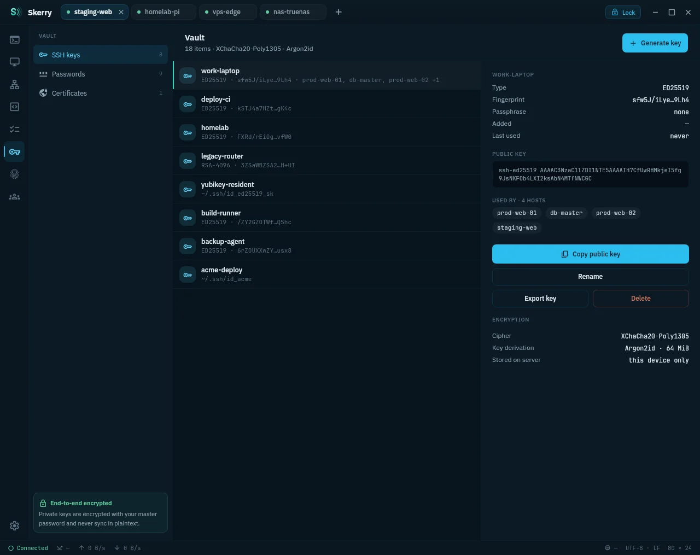

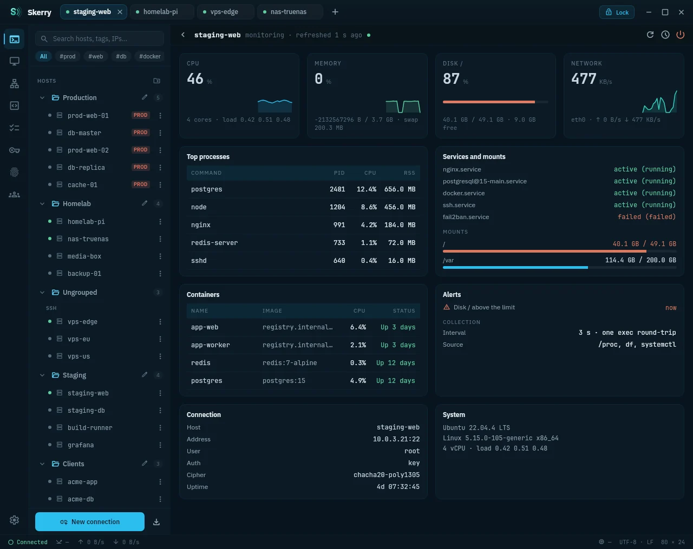

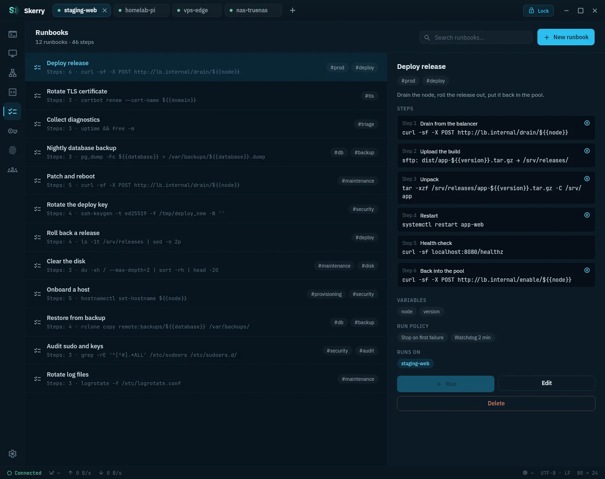

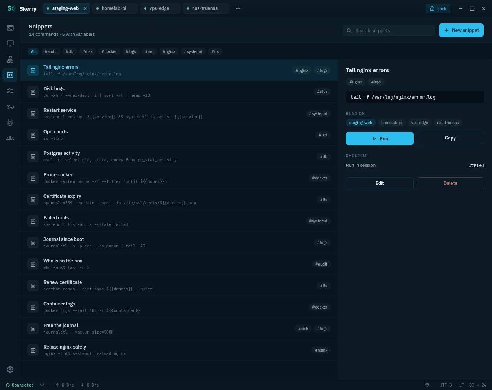

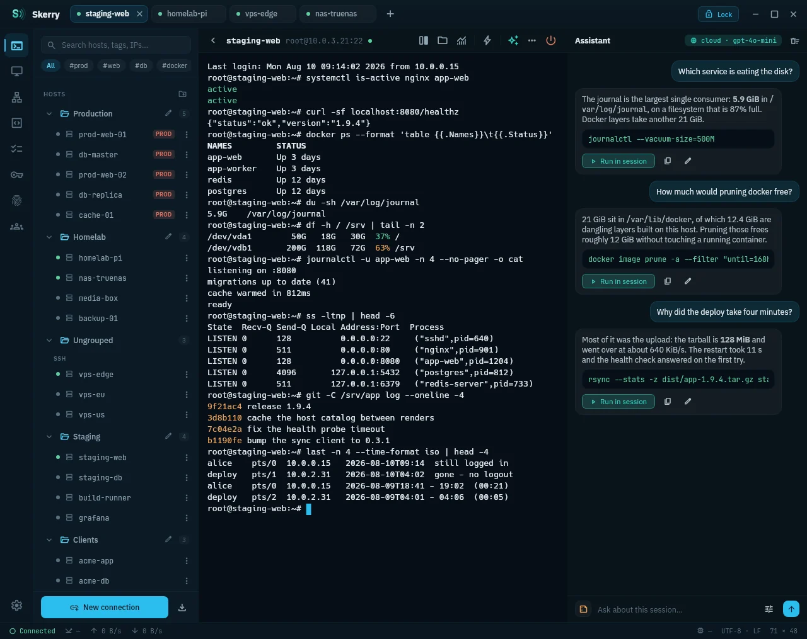

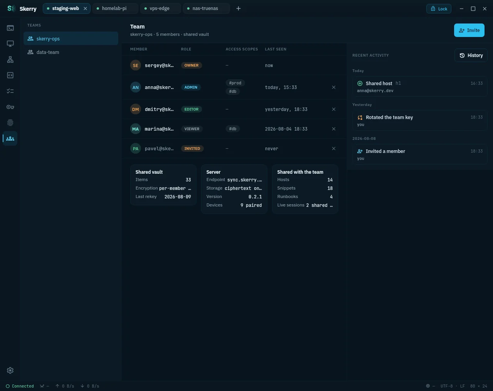

| 主机列表 | 终端 |
|---|---|
| 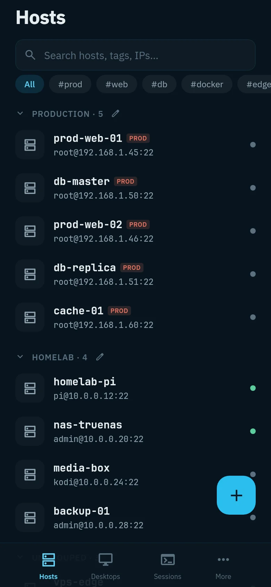 | 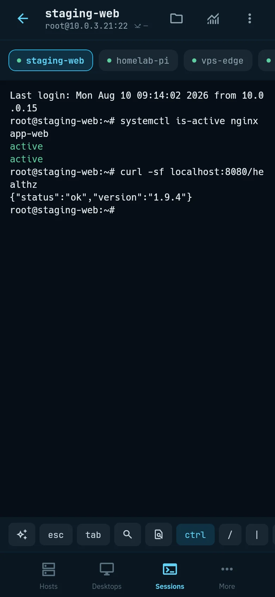 |

</details>

---

## 功能

- **协议** — SSH、Mosh、Telnet、串口（桌面端和 Android USB-OTG），以及完全不需要连接的
  本地 shell 标签页。
- **SSH** — 跳板机（ProxyJump）、来自保险库或磁盘的证书、CA 签发的主机密钥证书、
  keyboard-interactive 双因素认证、自动重连、从 `~/.ssh/config` 导入主机。
- **SFTP** — 双栏文件管理器：文件查看器和编辑器、可排序的列、名称过滤、传输队列。
- **端口转发** — 本地、远程、动态/SOCKS；保险库解锁后自动建立转发；一键转发在主机上
  发现的端口。
- **容器** — 直接从主机 exec 进入 Docker 容器或 Kubernetes Pod。
- **远程桌面** — 为本项目编写的 VNC 和 RDP 客户端栈：截图、Ctrl+Alt+Del、剪贴板交换、
  会话中途改设置。有解码器时 RDP 支持 H.264：Android 始终可用，桌面端需要 PATH 上有
  `ffmpeg`。
- **终端** — 自研网格模拟，每个标签页最多四个平铺窗格并同步输入、回滚缓冲区搜索、语法高亮、
  基于历史的命令面板、向多个会话广播输入、把输出里的文件路径在 SFTP 中打开、
  会话录制（asciinema v2）并可在应用内回放。
- **主机监控** — 独立界面：带历史曲线的 CPU、内存和网络，以水位显示的磁盘和交换分区，
  进程排行，systemd 单元，挂载点，容器，以及在设备上触发的阈值告警。
- **会话共享** — 通过端到端加密通道把终端串流给同事，只读或交出键盘。
- **生产环境守卫** — 对带 `prod` 标签主机上的每条命令做风险评分，危险命令需要确认。
- **运行手册** — 在实时会话中逐步执行一套流程：每一步是一条命令或一次 SFTP 传输，
  可暂停等待确认，退出码非零则停止。运行日志记录每一步的状态、耗时和输出。
- **片段** — 命令库，带前缀补全，`${{…}}` 变量（日期/时间、uuid、随机数、剪贴板、
  保险库密文、交互输入的参数）在运行时展开，并先给出确认预览。
- **AI** — 按主机设定策略，桌面端在会话旁提供助手面板，移动端按键呼出输入表单，
  可用自己的 OpenAI 密钥或本地模型。参见 [AI 与隐私](#ai-与隐私)。
- **保险库** — Argon2id + XChaCha20-Poly1305 保护密钥、密码、身份和证书，Android 支持
  生物识别解锁；密文卡片显示算法、指纹、有效期、依赖方和最近一次使用；30 天回收站，
  可在任何已同步设备上恢复。
- **同步** — 可选、自托管、零知识：通过 WebSocket 实时推送，扫码配对设备，
  浏览器端账号区域由单独的密码保护 — 只有元数据和设备吊销，别无其他。
  参见 [同步服务器](#同步服务器)。
- **团队** — 端到端加密地共享主机、片段和运行手册，按成员设定访问范围，
  活动流记录谁改了哪台主机、谁开了哪个会话。
- **界面** — 深色和浅色主题，终端跟随应用主题，“系统”模式跟随操作系统，
  界面语言支持英语、俄语和简体中文。

---

## AI 与隐私

助手的行为边界：

- **请求内容** — 请求文本和一段固定的系统提示。终端输出、主机列表和保险库记录都不会发送。
- **云端模式** — 只用你自己的 OpenAI 密钥：流量从应用直达你设置的端点，中间没有任何服务器。
- **主机策略** — 决定请求发往何处：
  - **严格**（新主机的默认值）— 只用本地模型。
  - **均衡** — 走云端，但从提示中剥离明显的密文：私钥、令牌、`password=…`。
    该机制基于模式匹配，不提供任何保证。
  - **宽松** — 不做脱敏直接走云端，适用于不敏感的系统。
  - **关闭** — 在该主机上隐藏助手。
- **快速对话** — 始终开启脱敏，本地模型也不例外。
- **本地模型** — 通过设备上的 llama.cpp 运行 GGUF（Qwen3、Phi-4 Mini），没有外发流量。
- **命令执行** — 模型输出不可信：执行需要明确确认，危险命令需要再确认一次。

---

## 技术栈

- **语言与界面** — Kotlin 2.4、Compose Multiplatform 1.9
- **构建** — Gradle 9.6、Android Gradle Plugin 9.1、JDK 21（所有模块均为 `jvmToolchain(21)`）
- **Android** — minSdk 26（Android 8.0）、compileSdk 37、targetSdk 36
- **SSH 与加密** — sshj、BouncyCastle、libsodium（ionspin KMP）：Argon2id +
  XChaCha20-Poly1305
- **终端** — 自研网格模拟，桌面端本地 shell 使用 pty4j
- **远程桌面** — 为本项目编写的 VNC（RFB）和 RDP 栈，不依赖第三方客户端
- **串口** — jSerialComm（桌面端）、usb-serial-for-android（Android）
- **AI** — 本地模型用 llamatik（llama.cpp 绑定），云端用 Ktor 客户端
- **同步** — Ktor（客户端和服务端）、Exposed、SQLite/PostgreSQL、HikariCP、Nimbus SRP-6a
- **质量** — JUnit 5、Kover 覆盖率、detekt 静态分析

确切版本见 [`gradle/libs.versions.toml`](gradle/libs.versions.toml)。

---

## 仓库结构

```
shared/       # KMP 内核: ssh/, sftp/, vault/, sync/, team/, share/, terminal/, ai/ (+ai/local),
              # telnet/, serial/, mosh/, rdp/, vnc/, graphics/, audio/, tunnel/, container/,
              # snippet/, runbook/, host/, tag/, files/, guard/, update/
composeApp/   # 界面 (Compose Multiplatform): commonMain + androidMain + desktopMain
androidApp/   # Android 应用 (MainActivity, manifest), applicationId app.skerry
server/       # 自托管同步服务器 (Ktor, AGPL-3.0)
sync-wire/    # 客户端与服务端共用的传输协议契约
docs/         # 文档与设计素材
```

---

## 从源码构建

开发流程、提交规范和打包说明见 **[CONTRIBUTING.md](CONTRIBUTING.md)**。

需要 **JDK 21**（必要时 `foojay-resolver` 会自动获取）和 Android SDK — 每一次客户端构建都会
配置 `:androidApp`，因此即便只构建桌面端，也要设置 `ANDROID_HOME` 或在 `local.properties`
中设置 `sdk.dir`。

安装包按构建机器的操作系统和 CPU 架构生成：arm64 的 `.dmg` 只能在 macOS/ARM 上产出。

```bash
./gradlew :composeApp:run                                # 运行
./gradlew :composeApp:packageDistributionForCurrentOS    # .deb / .rpm / .msi / .dmg
./gradlew :composeApp:packageAppImage                    # 便携版 Linux .AppImage
./gradlew :composeApp:packagePortableZip                 # 便携版 .zip
```

Android：

```bash
ANDROID_HOME=$HOME/Android/Sdk ./gradlew :androidApp:installDebug
```

测试（JUnit 5）和静态分析：

```bash
./gradlew test allTests    # 只跑 `test` 会跳过多平台模块
./gradlew detektAll        # 既有问题记录在 gradle/detekt-baseline-*.xml
```

---

## 同步服务器

服务器只用于同步设备，而且始终是你自己的服务器：不存在厂商云。

设计上零知识：留在服务器上的是密文（包装后的 `dataKey`、加密的保险库记录）和同步元数据。
认证使用 SRP-6a，密码从不传输，服务器无法解密你存放的任何内容。

快速开始 — 使用 [Docker Hub](https://hub.docker.com/r/secherkasov/skerry-sync) 上的
多架构预构建镜像，SQLite 存放在具名卷中，无需配置：

```bash
docker run -d --name skerry-sync -p 8080:8080 \
  -e SKERRY_JWT_SECRET="$(openssl rand -base64 48)" \
  -e SKERRY_ADMIN_TOKEN="$(openssl rand -hex 16)" \
  -v skerry-data:/data \
  secherkasov/skerry-sync:latest
```

服务器监听 `http://localhost:8080`，并自带一个离线的内置 Web 前端：`/` 是公开页面，
`/account` 是账号中心，`/console` 是运维控制台。从源码构建 — 在仓库根目录执行
`docker compose up -d --build`；PostgreSQL 由 [docker-compose.yml](docker-compose.yml)
中的 `db` 服务和 postgres 相关变量启用。仅构建服务端时不需要 Android SDK：
`./gradlew :server:run -PserverOnly`。

配置、API 端点、TLS 终结（Caddy/nginx）、备份和隐私模型见
**[server/README.md](server/README.md)**（[中文](server/README.zh.md)）。

---

## 安全

私密漏洞报告、受支持的版本、威胁模型和审计状态见 **[SECURITY.md](SECURITY.md)**。

---

## 参与开发

欢迎提交 issue 和 pull request。环境搭建、模块结构、项目的开发方式以及 PR 需要满足的条件见
**[CONTRIBUTING.md](CONTRIBUTING.md)**。

---

## 许可证

- 客户端（`shared/`、`composeApp/`、`androidApp/`）— [GPL-3.0](LICENSE)
- 同步服务器（`server/`）— [AGPL-3.0](server/LICENSE)：以服务形式托管的分支必须把改动
  回馈给本项目。
- 内置字体 — OFL-1.1 和 Apache-2.0，文本和版本见 [licenses/](licenses/README.md)
